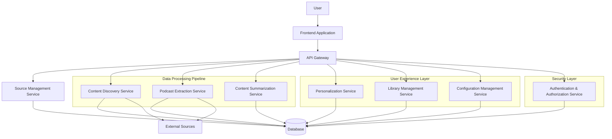

# Design Document: AI Information Aggregator

## Overview

The AI Information Aggregator is a comprehensive system designed to help UX Designers and professionals stay current with developments in the AI/LLM space. This document outlines the technical architecture, components, interfaces, data models, error handling strategies, and testing approaches for implementing the system based on the requirements.

The system will employ a modular, scalable architecture that separates concerns between data collection, processing, storage, and presentation. It will leverage AI/ML capabilities for content analysis, summarization, and personalization while providing an intuitive user interface for information consumption and system configuration.

## Architecture

The system will follow a microservices architecture pattern with the following high-level components:



### Key Architectural Decisions:

1. **Microservices Architecture**: Enables independent scaling, development, and deployment of system components.
2. **Event-Driven Communication**: Services will communicate through events for asynchronous processing of content.
3. **API Gateway Pattern**: Centralizes API management, authentication, and routing.
4. **Containerization**: Services will be containerized for consistent deployment and scaling.
5. **Cloud-Native Design**: Leverages cloud services for scalability, reliability, and managed AI capabilities.

## Components and Interfaces

### 1. Frontend Application

**Responsibility**: Provides the user interface for interacting with the system.

**Key Features**:
- Responsive dashboard displaying personalized content
- Source management interface
- Content library with search and filtering
- System configuration controls
- Authentication and user profile management

**Technologies**:
- Modern web framework (React/Vue/Angular)
- Responsive design for multi-device support
- Data visualization libraries for content relationships
- Progressive Web App capabilities for offline access

**Interfaces**:
- REST/GraphQL API consumption from API Gateway
- WebSocket for real-time updates

### 2. API Gateway

**Responsibility**: Routes requests to appropriate microservices, handles authentication, and manages API versioning.

**Key Features**:
- Request routing
- Authentication and authorization
- Rate limiting
- Request/response transformation
- API documentation

**Technologies**:
- API Gateway solution (Kong, AWS API Gateway, etc.)
- OpenAPI/Swagger for documentation

**Interfaces**:
- REST/GraphQL endpoints for frontend
- Service-to-service communication

### 3. Source Management Service

**Responsibility**: Manages information sources and their metadata.

**Key Features**:
- Source validation and storage
- Source categorization
- Relevance rating management
- Authentication management for protected sources

**Interfaces**:
- REST API for CRUD operations on sources
- Event publishing for source changes

### 4. Content Discovery Service

**Responsibility**: Monitors sources and discovers new content.

**Key Features**:
- Scheduled content checking
- Reference extraction
- Relevance assessment
- Discovery queue management

**Interfaces**:
- Integration with external content sources
- Event publishing for discovered content
- Internal API for queue management

### 5. Podcast Extraction Service

**Responsibility**: Processes podcast content to extract references.

**Key Features**:
- Audio processing
- Speech-to-text conversion
- Reference identification
- Timestamp linking
- Show notes analysis

**Interfaces**:
- Integration with podcast platforms
- Event consumption for new podcast episodes
- Event publishing for extracted references

### 6. Content Summarization Service

**Responsibility**: Analyzes and summarizes content.

**Key Features**:
- Text summarization
- Key insight extraction
- Content categorization
- Academic paper analysis
- News article analysis
- Visual content description

**Interfaces**:
- Event consumption for new content
- Event publishing for processed content
- Internal API for on-demand summarization

### 7. Personalization Service

**Responsibility**: Manages user preferences and content personalization.

**Key Features**:
- User interest modeling
- Content relevance scoring
- Interaction learning
- Breaking news detection
- Focus area management

**Interfaces**:
- Event consumption for user interactions
- Internal API for personalized content retrieval

### 8. Library Management Service

**Responsibility**: Manages the content library and organization.

**Key Features**:
- Content metadata management
- Search functionality
- Related content identification
- Content aging management
- Collection management
- Export functionality

**Interfaces**:
- Internal API for library operations
- Event consumption for new content

### 9. Configuration Management Service

**Responsibility**: Manages system configuration and user preferences.

**Key Features**:
- Topic preference management
- Notification settings
- Content volume control
- Discovery aggressiveness settings
- Summary length preferences
- Digest scheduling

**Interfaces**:
- Internal API for configuration operations
- Event publishing for configuration changes

### 10. Authentication & Authorization Service

**Responsibility**: Manages user authentication and authorization.

**Key Features**:
- User registration and authentication
- Role-based access control
- Secure credential storage
- Data privacy management
- Export and deletion functionality

**Interfaces**:
- Internal API for authentication and authorization
- Event publishing for security events

## Data Models

### 1. User

```json
{
  "id": "string",
  "email": "string",
  "passwordHash": "string",
  "name": "string",
  "preferences": {
    "topics": ["string"],
    "contentVolume": "number",
    "discoveryAggressiveness": "number",
    "summaryLength": "string",
    "digestFrequency": "string"
  },
  "notifications": {
    "email": "boolean",
    "push": "boolean",
    "digest": "boolean"
  },
  "created": "datetime",
  "lastLogin": "datetime"
}
```

### 2. Source

```json
{
  "id": "string",
  "url": "string",
  "name": "string",
  "type": "enum(website, blog, academic, podcast, social)",
  "categories": ["string"],
  "relevanceScore": "number",
  "checkFrequency": "string",
  "lastChecked": "datetime",
  "requiresAuthentication": "boolean",
  "credentials": {
    "encrypted": "string"
  },
  "discoveredFrom": "string",
  "active": "boolean",
  "created": "datetime",
  "updated": "datetime"
}
```

### 3. Content

```json
{
  "id": "string",
  "sourceId": "string",
  "url": "string",
  "title": "string",
  "author": "string",
  "publishDate": "datetime",
  "discoveryDate": "datetime",
  "type": "enum(article, paper, podcast, video, social)",
  "categories": ["string"],
  "topics": ["string"],
  "relevanceScore": "number",
  "summary": "string",
  "keyInsights": ["string"],
  "fullText": "string",
  "references": ["string"],
  "visualElements": [{
    "type": "string",
    "url": "string",
    "description": "string"
  }],
  "metadata": {
    "key": "value"
  },
  "processed": "boolean",
  "outdated": "boolean",
  "created": "datetime",
  "updated": "datetime"
}
```

### 4. Reference

```json
{
  "id": "string",
  "sourceContentId": "string",
  "referenceType": "enum(citation, mention, link)",
  "title": "string",
  "url": "string",
  "authors": ["string"],
  "publishDate": "datetime",
  "context": "string",
  "timestamp": "string",
  "resolved": "boolean",
  "targetContentId": "string",
  "created": "datetime",
  "updated": "datetime"
}
```

### 5. Collection

```json
{
  "id": "string",
  "userId": "string",
  "name": "string",
  "description": "string",
  "contentIds": ["string"],
  "public": "boolean",
  "created": "datetime",
  "updated": "datetime"
}
```

### 6. Interaction

```json
{
  "id": "string",
  "userId": "string",
  "contentId": "string",
  "type": "enum(view, save, share, dismiss)",
  "timestamp": "datetime",
  "metadata": {
    "key": "value"
  }
}
```

## Error Handling

The system will implement a comprehensive error handling strategy to ensure reliability and graceful degradation:

### 1. Error Categorization

Errors will be categorized into:
- **Transient Errors**: Temporary issues that may resolve with retries (network timeouts, service unavailability)
- **Permanent Errors**: Issues that require intervention (invalid credentials, permission issues)
- **Business Logic Errors**: Issues related to application logic (invalid data, constraint violations)
- **System Errors**: Unexpected exceptions and crashes

### 2. Retry Policies

- Implement exponential backoff for transient errors
- Circuit breaker pattern for failing external services
- Dead letter queues for messages that cannot be processed

### 3. Graceful Degradation

- Provide partial functionality when some services are unavailable
- Cache critical data for offline operation
- Implement fallback mechanisms for AI/ML services

### 4. Monitoring and Alerting

- Centralized error logging
- Real-time alerting for critical errors
- Error rate monitoring and thresholds
- Correlation of errors across services

### 5. User Feedback

- Clear error messages for user-facing issues
- Actionable recovery steps where applicable
- Feedback collection for unexpected errors

## Testing Strategy

The system will employ a comprehensive testing strategy to ensure quality and reliability:

### 1. Unit Testing

- Test individual components and functions
- Mock external dependencies
- Achieve high code coverage (target: >80%)
- Automated as part of CI/CD pipeline

### 2. Integration Testing

- Test service interactions
- Test database operations
- API contract testing
- Event processing verification

### 3. System Testing

- End-to-end workflows
- Performance testing under load
- Resilience testing (chaos engineering)
- Security testing (penetration testing, vulnerability scanning)

### 4. AI/ML Model Testing

- Model accuracy validation
- Bias detection
- Performance benchmarking
- A/B testing for personalization algorithms

### 5. User Experience Testing

- Usability testing with target users
- Accessibility compliance (WCAG)
- Cross-browser and cross-device testing
- User journey validation

### 6. Continuous Testing

- Automated regression testing
- Smoke tests for deployments
- Monitoring-based testing in production
- Feature flag testing for gradual rollouts

## Security Considerations

### 1. Data Protection

- Encryption at rest for all sensitive data
- Encryption in transit (TLS/SSL)
- Data anonymization for analytics
- Regular security audits

### 2. Authentication and Authorization

- Multi-factor authentication option
- Role-based access control
- JWT or OAuth 2.0 for API authentication
- Session management and timeout policies

### 3. External Service Security

- Secure credential storage
- API key rotation
- Rate limiting
- IP whitelisting where applicable

### 4. Compliance

- GDPR compliance for user data
- CCPA compliance where applicable
- Data retention policies
- Right to be forgotten implementation

## Deployment and DevOps

### 1. Infrastructure

- Cloud-based deployment (AWS/GCP/Azure)
- Containerization with Docker
- Orchestration with Kubernetes
- Infrastructure as Code (Terraform/CloudFormation)

### 2. CI/CD Pipeline

- Automated builds and testing
- Deployment automation
- Blue/green deployment strategy
- Rollback capabilities

### 3. Monitoring and Observability

- Distributed tracing
- Centralized logging
- Performance metrics
- Health checks and alerting

### 4. Scaling Strategy

- Horizontal scaling for stateless services
- Database sharding for data growth
- Caching strategy for frequently accessed data
- Auto-scaling based on load metrics