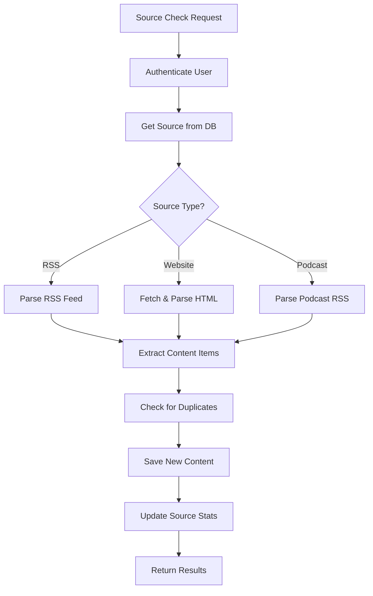
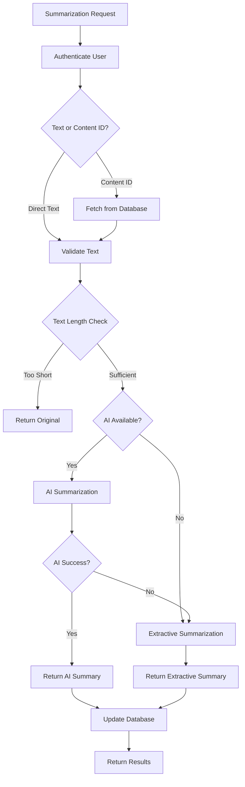
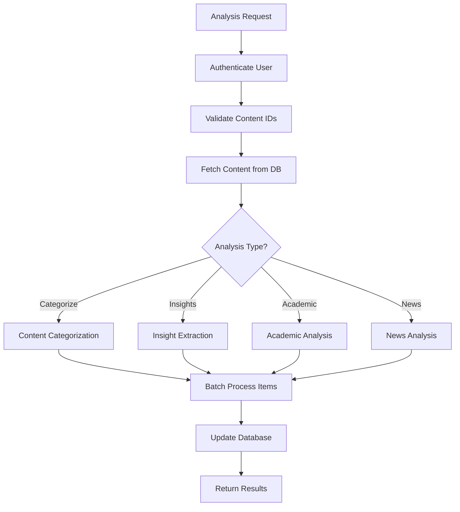

# Content Processing Serverless Functions

This directory contains serverless functions for content discovery, summarization, and analysis, migrated from the original microservices architecture to work with Vercel's serverless platform.

## Functions Overview

### 1. Content Discovery (`/api/content/discover.js`)

Handles content discovery from various sources including RSS feeds, websites, and podcasts.

**Endpoints:**
- `GET /api/content/discover` - Get discovery status and configuration
- `POST /api/content/discover` - Trigger content discovery for a specific source

**Features:**
- RSS feed parsing with support for custom fields
- Website content extraction using Cheerio
- Intelligent content link detection
- Error handling and source status tracking
- Support for multiple source types (RSS, website, blog, podcast)

**Request Examples:**
```javascript
// Get discovery status
GET /api/content/discover?sourceId=123

// Trigger discovery for a source
POST /api/content/discover
{
  "sourceId": 123,
  "immediate": true
}
```

**Response Format:**
```javascript
{
  "success": true,
  "message": "Found 5 new content items",
  "contentFound": true,
  "newContentCount": 5,
  "newContent": [
    {
      "id": 456,
      "title": "AI Breakthrough in Healthcare",
      "url": "https://example.com/ai-healthcare",
      "type": "article",
      "publish_date": "2024-01-15T10:00:00Z"
    }
  ]
}
```

### 2. Content Summarization (`/api/content/summarize.js`)

Provides AI-powered and extractive text summarization capabilities.

**Endpoints:**
- `GET /api/content/summarize` - Get summarization configuration
- `POST /api/content/summarize` - Summarize text or content by ID

**Features:**
- AI-powered summarization using OpenAI GPT-3.5-turbo
- Extractive summarization fallback using NLP techniques
- Configurable summary length and detail levels
- Sentence scoring based on word frequency and key phrases
- Support for both direct text and database content

**Request Examples:**
```javascript
// Get configuration
GET /api/content/summarize

// Summarize text directly
POST /api/content/summarize
{
  "text": "Long article text here...",
  "options": {
    "length": "medium",
    "detail": "balanced",
    "temperature": 0.3
  }
}

// Summarize content by ID
POST /api/content/summarize
{
  "contentId": 456,
  "options": {
    "length": "brief",
    "detail": "balanced"
  }
}
```

**Response Format:**
```javascript
{
  "success": true,
  "data": {
    "summary": "AI has revolutionized healthcare through machine learning algorithms that can diagnose diseases with 95% accuracy.",
    "originalLength": 1250,
    "summaryLength": 87,
    "compressionRatio": 0.07,
    "method": "ai_based",
    "confidence": 0.9
  }
}
```

### 3. Content Analysis (`/api/content/analyze.js`)

Performs batch content analysis including categorization, insight extraction, and specialized analysis for academic and news content.

**Endpoints:**
- `GET /api/content/analyze` - Get analysis configuration
- `POST /api/content/analyze` - Perform batch content analysis

**Features:**
- Content categorization with predefined and custom categories
- Key insight extraction using AI and rule-based methods
- Academic paper analysis with section detection
- News article analysis with credibility and bias assessment
- Batch processing for up to 20 content items

**Request Examples:**
```javascript
// Get configuration
GET /api/content/analyze

// Categorize content
POST /api/content/analyze
{
  "action": "categorize",
  "contentIds": [456, 789, 101],
  "options": {}
}

// Extract insights
POST /api/content/analyze
{
  "action": "extract_insights",
  "contentIds": [456],
  "options": {
    "maxInsights": 5
  }
}

// Analyze academic content
POST /api/content/analyze
{
  "action": "analyze_academic",
  "contentIds": [789],
  "options": {
    "extractSections": true
  }
}

// Analyze news content
POST /api/content/analyze
{
  "action": "analyze_news",
  "contentIds": [101],
  "options": {
    "includeCredibility": true,
    "includeBias": true
  }
}
```

**Response Format:**
```javascript
{
  "success": true,
  "data": {
    "results": [
      {
        "contentId": 456,
        "title": "AI in Healthcare",
        "categories": ["Technology", "Health"],
        "confidence": 0.8
      }
    ],
    "processed": 3,
    "successful": 3,
    "failed": 0
  }
}
```

## Technical Implementation

### Dependencies

- **axios**: HTTP client for fetching web content
- **cheerio**: Server-side HTML parsing and manipulation
- **compromise**: Natural language processing
- **natural**: NLP toolkit for tokenization and stemming
- **openai**: AI-powered text processing
- **rss-parser**: RSS feed parsing

### Architecture

The functions follow a serverless architecture pattern:

1. **Authentication**: Each function validates user authentication via JWT tokens
2. **Database Connection**: Uses connection pooling for efficient database access
3. **Error Handling**: Comprehensive error handling with graceful degradation
4. **AI Integration**: OpenAI integration with extractive fallbacks
5. **Batch Processing**: Efficient batch processing with configurable limits

### Content Discovery Workflow



### Summarization Workflow



### Analysis Workflow



## Configuration

### Environment Variables

```bash
# Database Configuration
DATABASE_HOST=your-database-host
DATABASE_USERNAME=your-username
DATABASE_PASSWORD=your-password
DATABASE_NAME=your-database-name

# AI Configuration (Optional)
OPENAI_API_KEY=your-openai-api-key

# Authentication
JWT_SECRET=your-jwt-secret
```

### Default Categories

The system includes predefined categories:

- **Technology**: AI, machine learning, software, programming
- **Science**: Research, studies, experiments, discoveries
- **Business**: Markets, companies, revenue, investments
- **Health**: Medical, treatments, diseases, patients
- **Education**: Learning, universities, academic content
- **Politics**: Government, policies, elections, regulations
- **Environment**: Climate, sustainability, green technology
- **Finance**: Banking, investments, cryptocurrency, trading

### Processing Limits

- **Discovery**: 10 content links per website check
- **Summarization**: 50,000 characters max input
- **Analysis**: 20 content items per batch
- **Timeout**: 10 seconds per external request

## Error Handling

All functions implement comprehensive error handling:

1. **Authentication Errors**: 401 Unauthorized
2. **Validation Errors**: 400 Bad Request with details
3. **Not Found Errors**: 404 with specific resource info
4. **Processing Errors**: 500 with error details (sanitized)
5. **Rate Limiting**: Automatic retry with exponential backoff

## Testing

Run the test suites to verify functionality:

```bash
# Test function structure and authentication
npm run content:test

# Test core processing workflows
npm run workflow:test
```

## Deployment

These functions are designed for Vercel's serverless platform:

1. **Automatic Scaling**: Functions scale based on demand
2. **Cold Start Optimization**: Minimal dependencies and efficient initialization
3. **Memory Management**: Optimized for 1024MB memory limit
4. **Timeout Handling**: 10-second timeout for Hobby plan compatibility

## Performance Considerations

- **Connection Pooling**: Database connections are pooled and reused
- **Caching**: Content hashes prevent duplicate processing
- **Batch Processing**: Multiple items processed efficiently
- **Fallback Strategies**: AI failures gracefully degrade to rule-based methods
- **Memory Optimization**: Large text content is truncated when necessary

## Security

- **Authentication Required**: All endpoints require valid JWT tokens
- **Input Validation**: All inputs are validated and sanitized
- **SQL Injection Prevention**: Parameterized queries used throughout
- **Rate Limiting**: Built-in protection against abuse
- **Error Sanitization**: Sensitive information not exposed in errors

## Future Enhancements

1. **Anthropic Claude Integration**: Replace OpenAI with Claude for better performance
2. **Advanced Content Detection**: Improve academic and news content detection
3. **Custom Categories**: User-defined category management
4. **Real-time Processing**: WebSocket support for live content updates
5. **Advanced Analytics**: Content quality scoring and trend analysis